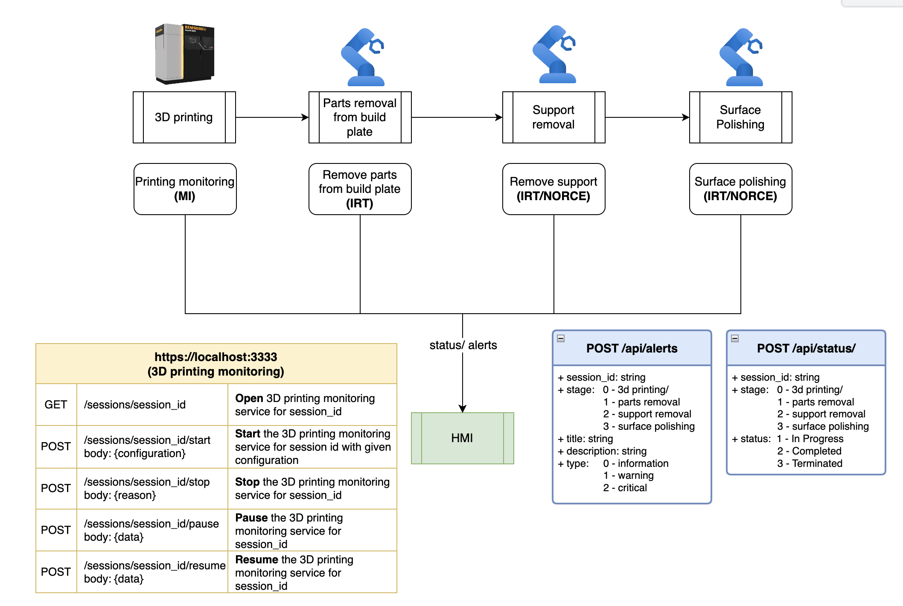

# pilot03-user-interface-hmi
Human Machine Interface for Pilot 03 (CROOM) - outputs live data of the process, integrated with warning signals and alerts highlighting the issue. 

The system uses Node.js with Express for the backend, MongoDB for the database, and React with Ant Design for the frontend.

## Table of Contents

- [Features](#features)
- [Installation](#installation)
- [Usage](#usage)
- [API Endpoints](#api-endpoints)
- [Frontend Components](#frontend-components)
- [Contributing](#contributing)
- [License](#license)

## Features

- User authentication with roles (admin, operator, service).
- Create and manage manufacturing sessions.
- Track stages of a manufacturing session.
- Update stage status with dropdown options.
- Visualize stages using Ant Design's `Steps` component.
- Notifications for session updates.

## Installation

### Prerequisites

- Node.js
- npm
- MongoDB

### Backend Setup

1. Clone the repository:
   ```sh
   git clone https://github.com/your-username/manufacturing-session-management.git
   cd manufacturing-session-management
   ```

2. Install backend dependencies:
   ```sh
   cd server/
   npm install
   ```

3. Create a `.env` file in the backend directory and add the following:
   ```env
   MONGODB_URI=mongodb://localhost:27017/your_database_name
   JWT_SECRET=your_jwt_secret
   ```

4. Start the backend server:
   ```sh
   npm start
   ```

### Frontend Setup

1. Install frontend dependencies:
   ```sh
   cd client/
   npm install
   ```

2. Create a `config.js` file in the `frontend/src` directory and add the following:
   ```js
   export const API_BASE_URL = 'http://localhost:5000/api';
   ```

3. Start the frontend development server:
   ```sh
   npm start
   ```

## Usage

1. Open your browser and navigate to `http://localhost:3000`.
2. Register or log in as an admin, operator, or service user.
3. Create and manage manufacturing sessions.
4. Use the session detail page to track and update stages.

## API Endpoints

## License

This project is licensed under the GNU GENERAL PUBLIC LICENSE Version 3.0